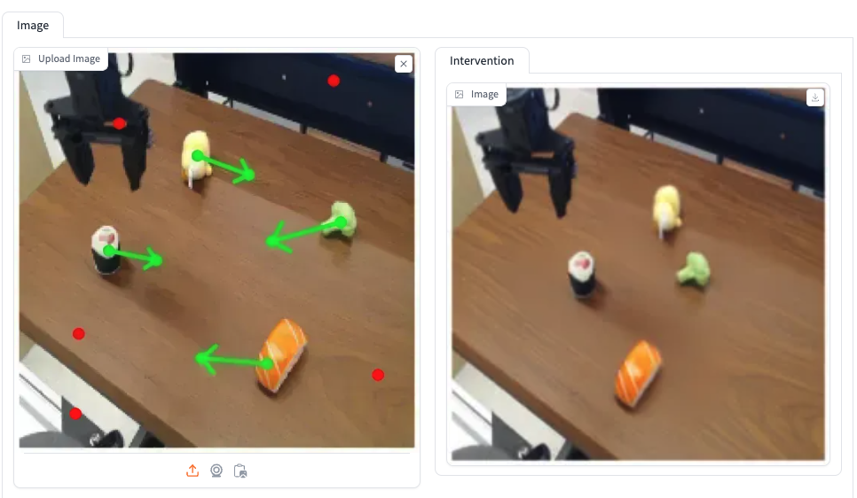
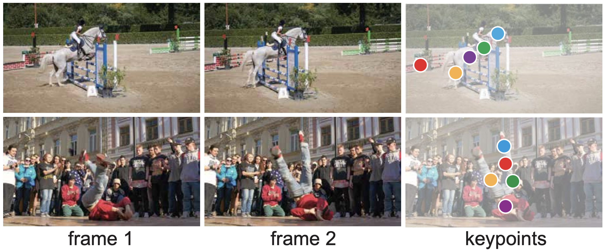
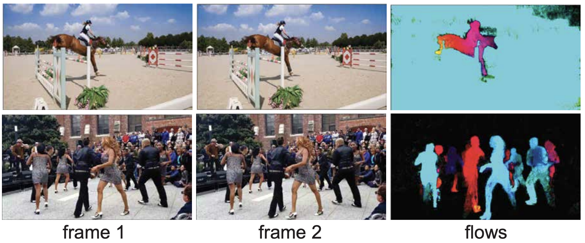
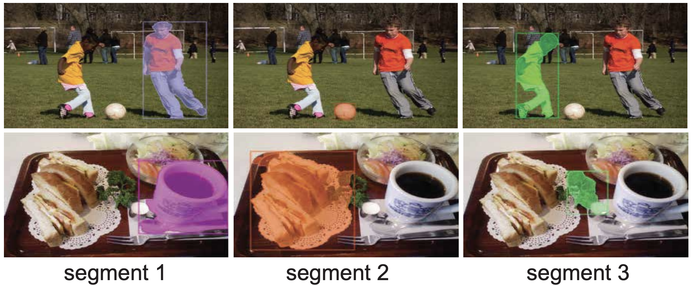
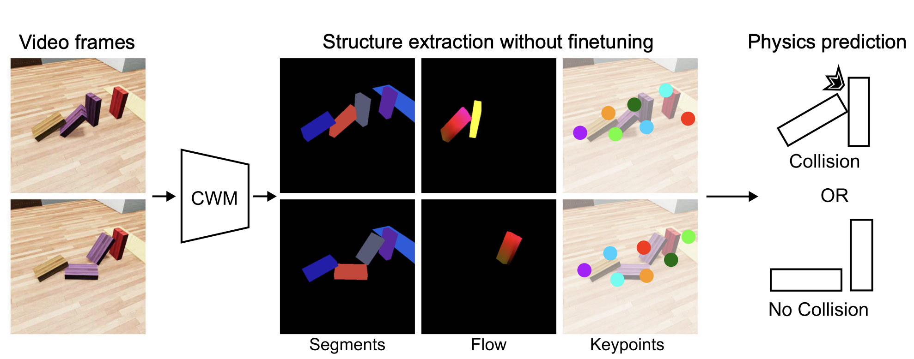
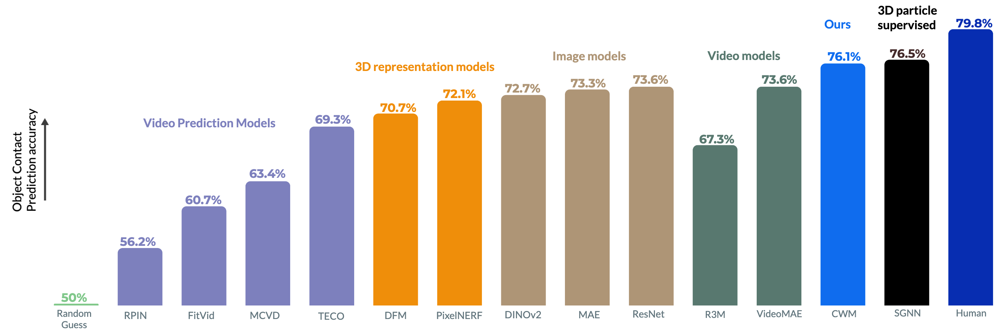

<div align="center">
<h2>Understanding Physical Dynamics with Counterfactual World Modeling</h2>

[**Rahul Venkatesh***](https://rahulvenkk.github.io/)<sup>1</sup> · [**Honglin Chen***](https://web.stanford.edu/~honglinc/)<sup>1*</sup> · [**Kevin Feigelis***](https://neuroscience.stanford.edu/people/kevin-t-feigelis)<sup>1</sup> · [**Daniel M. Bear**](https://twitter.com/recursus?lang=en)<sup>1</sup> · [**Khaled Jedoui**](https://web.stanford.edu/~thekej/)<sup>1</sup> · [**Klemen Kotar**](https://klemenkotar.github.io/)<sup>1</sup> · [**Felix Binder**](https://ac.felixbinder.net/)<sup>2</sup> · [**Wanhee Lee**](https://www.linkedin.com/in/wanhee-lee-31102820b/)<sup>1</sup> · [**Sherry Liu**](https://neuroailab.github.io/cwm-physics/)<sup>1</sup> · [**Kevin A. Smith**](https://www.mit.edu/~k2smith/)<sup>3</sup> · [**Judith E. Fan**](https://cogtoolslab.github.io/)<sup>1</sup> · [**Daniel L. K. Yamins**](https://stanford.edu/~yamins/)<sup>1</sup>

ECCV 2024

<sup>1</sup>Stanford&emsp;&emsp;&emsp;&emsp;<sup>2</sup>UCSD&emsp;&emsp;&emsp;&emsp;<sup>3</sup>MIT

(* equal contribution)

<a href="https://arxiv.org/abs/2312.06721"></a>
<a href='https://neuroailab.github.io/cwm-physics/'></a>
<a href='https://huggingface.co/spaces/rmvenkat/counterfactual-world-models'></a>
<a href='https://colab.research.google.com/drive/1KPbzCMBaQ-c3bMezKMkw_C1SHzge-mht?usp=sharing'></a>
</div>

This work presents the Counterfactual World Modeling (CWM) framework. CWM is capable of counterfactual prediction and extraction of vision structures useful for understanding physical dynamics.


## 📣 News

- 10-30-2024: Release [project page](https://neuroailab.github.io/cwm-physics/) and [codes](https://github.com/neuroailab/cwm_dynamics.git)

## 🔨 Installation

```
git clone https://github.com/neuroailab/cwm_dynamics.git
pip install -e .
```

## ✨ Usage
To download and use a pre-trianed model run the following
```
from cwm.model.model_factory import model_factory
model = model_factory.load_model('vitb_8x8patch_3frames')
```
This will automatically initialize the appropriate model class and download the specified weights to your `$CACHE` directory.

Colab notebook example of model inference:  [](https://colab.research.google.com/drive/1KPbzCMBaQ-c3bMezKMkw_C1SHzge-mht?usp=sharing)

## 📦 Pre-trained Models

We provide **four models** with varying patch size and number of frames of training:

[//]: # (## make a 5x4 grid of models)

|       Model Name        | Patch size | Params | #frames | Checkpoint                                                                                      |
|:-----------------------:|:------------:|:--------:|:---------:|:-------------------------------------------------------------------------------------------------:|
| `vitb_8x8patch_3frames` | 8x8        | 110M   | 3       | [Download](https://storage.googleapis.com/stanford_neuroai_models/cwm/3frame_cwm_8x8.pth)       |
| `vitb_8x8patch_2frames` | 8x8        | 110M   | 2       | [Download](https://storage.googleapis.com/stanford_neuroai_models/cwm/2frame_cwm_8x8.pth)       |
| `vitb_4x4patch_2frames` | 4x4        | 110M   | 2       | [Download](https://storage.googleapis.com/stanford_neuroai_models/cwm/2frame_cwm_4x4.pth)       |
| `vitl_8x8patch_3frames` | 8x8        | 330M   | 2       | [Download](https://storage.googleapis.com/stanford_neuroai_models/cwm/3frame_cwm_8x8_large.pth) |


## 🔄 Pre-training

CWM is pre-trained on Kinetics-400 video dataset. For more efficient data loading, we preprocess each video by chunking them into 10-second segments. 

### Prepare dataset
Our pre-processed Kinetics-400 dataset can be downloaded by running the following command in the root directory. The downloaded dataset takes about 470G.
```
python cwm/data/download_kinetics_data.py --save-path /path/to/kinetics/data
```
Once the data is successfully downloaded, we provide a script that generates a text file, which contains a list of video filenames in the folder specified by `--videos_path`. This script saves the text file to the destination specified by `--output_path`.

```
python cwm/data/prepare_video_file_list.py --videos_path /path/to/kinetics/data --output_path cwm/data/video_file_lists/kinetics400_training_list.txt
```

If the commands above execute successfully, a text file containing a list of video paths for training will be saved to `cwm/data/video_file_lists/kinetics400_training_list.txt`

### Start training
The training script takes in an argument specifying the path to the text file containing a list of video paths. For example, after executing the data preparation steps above, the training can be started by running the following command. The training script supports both single-node and multi-node DDP training, which can be specified by changing `MASTER_ADDRESS`, `NNODES`, and `NPROC_PER_NODE` in the script. By default, the training script uses 1 node with 8 GPUs.

```
./scripts/3frame_patch8x8_mr0.90_gpu.sh cwm/data/video_file_lists/kinetics400_training_list.txt
```

### Custom training data
If you prefer to train on your custom video data, this can be achieved by simply running `cwm/data/prepare_video_file_list.py` with `--video_path` specifying the folder path containing a list of custom videos. Once a custom video file list text file is created, you can run the same script above using the custom video file list.

## 🎨 Scene editing interventions with CWMs

We provide a gradio app hosted on hugging face spaces to demonstrate the prediction capabilities of CWMs. The app allows users to interactively edit the scene by specifying local patch movements to intervene in the scene. The model applies these interventions to generate predictions for the updated scene.

<a href='https://huggingface.co/spaces/rmvenkat/counterfactual-world-models'></a>

[//]: # (![]&#40;assets/gradio_demo.png&#41;)



The app can also be run on your local cluster using the following command
```
python3 gradio_app.py
```

Note: the [`get_intervention_outcome`](https://github.com/neuroailab/cwm_dynamics/blob/main/cwm/model/model_pretrain.py#L418) function in the model class is used in scene editing process. As listed below, it takes an input tensor and a set of patch motion parameters, allowing for direct intervention in the scene dynamics by moving patches of the image to new positions. 

```python
def get_intervention_outcome(self, x, move_patches):
    '''
    :param x: input tensor [1, C, T, H, W]: support only batch size 1 for now
    :param move_patches: torch tensor [N, 4] sized array where each row contains patch motion [x1, y1, x2, y2] in pixel coordinates
    :return:
    '''
```

## 🔍 Structure extraction 

We provide simple function abstractions in the model class to extract keypoints, flow and segments from the CWMs. In addition, we provide colab notebook provide usage examples for each of these structures extractions. 

| Structure | model function                                                                                                                                                                                                                                            | colab notebook |
|-----------|-----------------------------------------------------------------------------------------------------------------------------------------------------------------------------------------------------------------------------------------------------------|----------------|
| Keypoints | [`model.get_keypoints(...)`](https://github.com/neuroailab/cwm_dynamics/blob/main/cwm/model/model_pretrain.py#L599)                                                                                                                                       | [](https://colab.research.google.com/drive/1GyTfM46Ps7oBihQeMuZ4X1-SYJyzi957?usp=sharing) |
| Flow | [`model.get_flow_jacobian_method(...)`](https://github.com/neuroailab/cwm_dynamics/blob/main/cwm/model/model_pretrain.py#L526) [`model.get_flow_cost_volume(...)`](https://github.com/neuroailab/cwm_dynamics/blob/main/cwm/model/model_pretrain.py#L569) | [](https://colab.research.google.com/drive/1GGam6paa2IQdi8WUKFW7zQVXAKubJpXc?usp=sharing) |
| Segments | [`model.get_segment(...)`](https://github.com/neuroailab/cwm_dynamics/blob/main/cwm/model/model_pretrain.py#L500)                                                                                                                                         | [](https://colab.research.google.com/drive/1OFSnClwYMUCoqtMxC0znHvvr5Mi9Mvus?usp=sharing) |

### Keypoints: 
The `get_keypoints` function is used to extract keypoints from one or more input images. It can be applied to either two or three input frames, depending on the task.

```python
def get_keypoints(self, img1, img2, img3=None, num_keypoints=10, samples_per_keypoint=1):
    '''
    :param img1: input image 1 [B, C, H, W] ImageNet normalized
    :param img2: input image 2 [B, C, H, W] ImageNet normalized
    :param img3: input image 3 [B, C, H, W] ImageNet normalized. Is set to None for a 2-frame model
    :param num_keypoints: number of keypoints to extract
    :param samples_per_keypoint: number of samples per keypoint
    :return:
           mask: final mask with discovered keypoint patch locations set to True [B, number_of_patches]
           choices: x, y indices of keypoints [B, n_rounds, 2]
           err_array: the error maps for every keypoint found List [[B, n_samples, H, W]]*n_rounds
           feat: the features at the final state of the mask [B, C, H, W]
           keypoint_recon: the final reconstruction of the target frame (of the first element in the batch) given the keypoint patches [H, W, C]
    '''
```

[//]: # ()

### Flow: 
The `get_flow` function is used to extract flow for a pair of frames. In case of a three frame model one can optinally provide a third frame for conditioning. We provide two different methods to compute flow. We find that the jacobian method performs slightly better. However, the cost volume method is faster to run in practice as jacobian computation in PyTorch can be slow.   
```python
def get_flow_jacobian_method(self, img1, img2,
             perturbation_patch_size=8,
             aggregation_patch_size=8,
             mask_ratio=0.0):
    '''
    :param img1: input image 1 [B, C, H, W]
    :param img2: input image 2 [B, C, H, W]
    :param perturbation_patch_size: size of the patch to perturb when computing the jacobian
    :param aggregation_patch_size: size of the patch over which to aggregate responses
    :return: forward flow [B, 2, H, W]
    '''
```
```python
def get_flow_cost_volume_method(self, img1, img2,
             conditioning_img=None,
             mask_ratio=0.0,
             num_scales=1,
             num_mask_samples=1):
    '''
    :param img1: input image 1 [B, C, H, W]
    :param img2: input image 2 [B, C, H, W]
    :param mask_ratio: what frame2 mask ratio to use when extracting flow
    :param num_scales: number of scales at which to compute flow
    :param num_mask_samples: number of random samples of the target frame mask to use for getting a better statistical estimate of the optical flow
    :return: forward flow [B, 2, H, W]
    '''
```

[//]: # ()

### Segments:
The `get_segment` function is used to extract segmentation at a query location of an input image. 
```python
def get_segment(self, img, pos, num_samples=16, num_static=2, max_movement=8):
    '''
    :param img: Input image tensor of shape [B, C, H, W]
    :param pos: List of (x, y) pixel positions where segments will be generated.
    :(optional) param num_samples: Number of counterfactual motion samples to generate (default: 16).
    :(optional) param num_static: Number of static patches to sample from the background, which helps prevent
                       camera panning and focuses on object motion (default: 2).
    :(optional) param max_movement: Maximum magnitude of movement allowed in generating counterfactual motion.
                         (default: 8).
    :return: A segmentation map of shape [B, H, W], where B is 1, H is height, and W is width.
    '''
```

[//]: # ()


## 📉 Physion Benchmark

The **Physion benchmark** features realistic simulations of diverse physical scenarios where objects are manipulated in various configurations. It evaluates different types of physical reasoning, such as stability, rolling motion, and object linkage.

The benchmark includes two tasks:
- **Object Contact Prediction (OCP):** Tests a model’s ability to predict if two objects will make contact in the future based on a context video.
- **Object Contact Detection (OCD):** Assesses the model’s ability to detect if two objects have already made contact in the observed video.




### Colab notebook
We evaluate the performance of CWMs on the two tasks in the Physion benchmark. Please refer to this colab notebook for a detailed description of the evaluation pipeline: [](https://colab.research.google.com/drive/1DxwGhSLHvU00k0aTzFaujRQ7G_V1_bdU#scrollTo=RqdjMIH1YY8W). 

### Running the evaluation locally 
If you wish to run the evaluation locally in your cluster, please use the following command:

#### Install physion package
```
git clone https://github.com/neuroailab/physion_evaluator.git
cd physion_evaluator
pip install -e .
```

#### Run evaluation command
```
mode="ocp" #ocp or ocd
dir_for_saving="$HOME/physion_${mode}_evaluation/" #where results are saved
model_name="cwm.inference.physion.feature_extractor.CWM_base_8x8_3frame_mean_embed" #type of feature extraction
gpu=0
path_to_save_physion_dataset="$HOME/physion_dataset/"

sh cwm/inference/physion/run_eval.sh $mode $dir_for_saving $model_name $path_to_save_physion_dataset $gpu
```

We provide the following feature extraction implementations in the `cwm.inference.physion.feature_extractor` package

| Model Path                                                                                                                                   | Description                                  |
|----------------------------------------------------------------------------------------------------------------------------------------------|----------------------------------------------|
| [`CWM_base_8x8_3frame`](https://github.com/neuroailab/cwm_dynamics/blob/main/cwm/inference/physion/feature_extractor.py#L299)                | CWM embeddings only                         |
| [`CWM_base_8x8_3frame_mean_embed`](https://github.com/neuroailab/cwm_dynamics/blob/main/cwm/inference/physion/feature_extractor.py#L303)     | CWM embeddings aggregated per-frame         |
| [`CWM_base_8x8_3frame_keypoints`](https://github.com/neuroailab/cwm_dynamics/blob/main/cwm/inference/physion/feature_extractor.py#L308)      | CWM embeddings + keypoints                  |
| [`CWM_base_8x8_3frame_keypoints_flow`](https://github.com/neuroailab/cwm_dynamics/blob/main/cwm/inference/physion/feature_extractor.py#L314) | CWM embeddings + keypoints + flow           |


Our results compared to competitive baselines are shown below:



## Citation

If you find this project useful, please consider citing:

```bibtex
@article{venkatesh2023understanding,
  title={Understanding Physical Dynamics with Counterfactual World Modeling},
  author={Venkatesh, Rahul and Chen, Honglin and Feigelis, Kevin and Bear, Daniel M and Jedoui, Khaled and Kotar, Klemen and Binder, Felix and Lee, Wanhee and Liu, Sherry and Smith, Kevin A and others},
  journal={arXiv preprint arXiv:2312.06721},
  year={2023}
}
```
